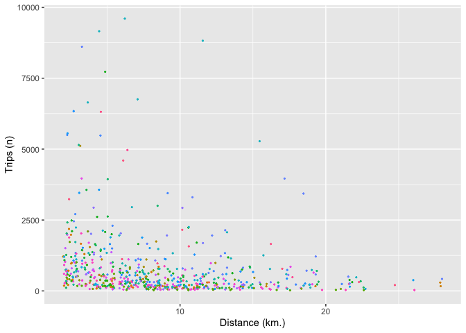
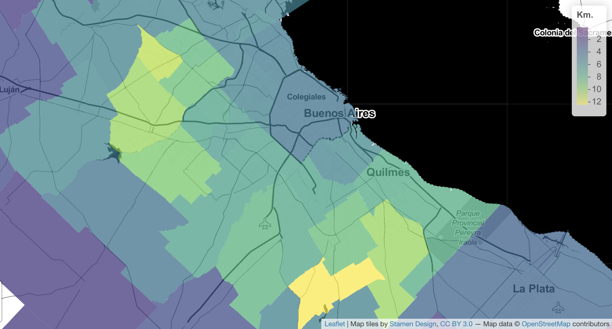

## Introduction

Cuando las personas usan la aplicación de Facebook con los servicios de ubicación habilitados, los servidores reciben y guardan una aproximación de la latitud y la longitud del dispositivo a intervalos regulares. La información de ubicación se usa de varias maneras, como proporcionar funciones o contenido dentro de la aplicación que es más relevante para las personas. Los datasets de Facebook Disaster Maps (incluidos en el portal de Facebook for Good) proporcionan información sobre dónde se encuentran las personas y cómo se mueven de forma agregada, preservando la privacidad con algunos procesos como el privacy masking y random noise, pero manteniendo la usabilidad y la interpretabilidad de los datos. La información se presenta en dos niveles: por mosaico o tiles (cuadrados) o por región administrativa (como los censos oficiales de población) y en tres definiciones horarias: 8 de la mañana, 4 de la tarde y a la medianoche (en huso horario UTC). 

En todos los casos, para compilar la información, Facebook parte tiles de 2 kilómetros por lado, detecta las coordenadas de las personas y las clasifica según el tile en el que han estado más tiempo en las ocho horas previas al momento de la hora mencionada en el dataset. Por ejemplo, si el conjunto de datos se refiere a las 8 a.m. y la persona estaba en su casa, Facebook clasificará a esa persona en el tile correspondiente y se lo asignará como un "**origen**". Si la persona pasó la mayor parte de las siguientes ocho horas en otro cuadrado, esa persona aparecerá en los datos agregados del segundo tile como "**destino**". Si aparece en el mismo tile, el origen y el destino será el mismo, incluso aunque la persona no se mueva. 
La siguiente tabla es un ejemplo para la ciudad de Santiago de algunas de las columnas del dataset Movement between Administrative Regions.

    head(trips, keepnums = FALSE)

    ##   start_polygon_name end_polygon_name trips length_km       date     city
    ## 1           Santiago        San Ramón    52     10.42 2021-10-05 Santiago
    ## 2           Santiago             Buin    47     32.49 2021-10-05 Santiago
    ## 3         La Florida     San Bernardo  1509     10.26 2021-10-05 Santiago
    ## 4        San Joaquín      Puente Alto   163     11.83 2021-10-05 Santiago
    ## 5        San Joaquín         Recoleta    90     10.00 2021-10-05 Santiago
    ## 6           Santiago         Vitacura   878     11.00 2021-10-05 Santiago

## Sesgo de población

Es para destacar la posibilidad de analizar los datos de manera sesgada si no se establecen ciertos parámetros o criterios a la hora de calcular distancias o flujos de personas. Con respecto a esto, la principal hipótesis que se introdujo fue que la distribución del uso de las aplicaciones de Facebook y/o el nivel de aceptación a activar la geolocalización en los dispositivos móviles a lo largo de cada una de las regiones administrativas a estudiar. Para intentar quitar este sesgo, se introdujo el uso de un tercer dataset proveniente de Facebook, el High Resolution Density Map (HRDM).
	Los datasets de High Resolution Density Maps toman información oficial de los censos y proyecciones de población de cada país y ubican a la población en función de su densidad y cantidad geoespacialmente a través de mecanismos de machine learning. A esta información se le realiza una unión espacial con los polígonos de los municipios y de esta forma se obtiene la población de cada uno de ellos. Por lo tanto, se elimina el sesgo de uso tomando sumas de todos los viajes de cada uno de los orígenes y comparándolos con la población correspondiente de cada región. De allí se extraen factores de expansión o pesos que aplicamos a los viajes de cada región administrativa para tener una noción más real de los flujos de personas entre municipios.

## Viajes cortos o nulos

Como se mencionó anteriormente, los tiles son cuadrados de 2 kilómetros por lado. Esto genera una limitación en el trabajo, ya que, por ejemplo, viajes de 1.9 kilómetros en el mismo tile van a figurar como “viajes cortos” con distancia media cero (inicio y llegada en el mismo tile), y otros viajes de menos de 1 km pero con origen y destino en tiles vecinos y estando significativamente alejados del centroide del tile van a figurar de manera agregada dentro del grupo de viajes que poseen distancia media de 2 o 2.82 kilómetros, dependiendo si el tile vecino está limítrofe a los lados o en diagonal, respectivamente. 
	Para evitar que este sesgo se propague cuando se analizan regiones administrativas y distancias medias, se decidió eliminar del análisis a los viajes que tienen origen y destino en el mismo tile. Esto se materializó de la siguiente manera: se toman las personas que tienen como origen y como destino la misma región administrativa pero distinto tile. Luego, se aplican dos factores de expansión: el primero de acuerdo a la cantidad de personas que viajan dentro del límite administrativo que figura en el dataset de Movement Between Administrative Regions y el segundo según la población (como se explicó previamente), para luego sumarse a la cantidad de personas que viajan entre distintas regiones administrativas. 

    head(avg_dist, keepnums = FALSE)

    ##        adm_region avg_dist       date         city
    ## 1 Almirante Brown 8.691195 2021-10-05 Buenos Aires
    ## 2      Avellaneda 5.945217 2021-10-05 Buenos Aires
    ## 3     Berazategui 7.838638 2021-10-05 Buenos Aires
    ## 4         Berisso 4.200039 2021-10-05 Buenos Aires
    ## 5        Brandsen 2.175535 2021-10-05 Buenos Aires
    ## 6         Campana 2.467033 2021-10-05 Buenos Aires

## Output

Luego de realizar todas las operaciones mencionadas anteriormente, se obtienen tablas que contienen las distancias promedio recorridas y los viajes realizados en cada una de las tiles y regiones administrativas. Estos conjuntos de datos se pueden analizar y graficar fácilmente. Por ejemplo, podemos obtener un diagrama de dispersión de distancias y viajes para una ciudad específica.

    trips %>% 
      filter(date=="2021-10-10", length_km > 0.5, trips < 10000) %>% 
      ggplot() +
      geom_point(aes(length_km, trips, 
                     color = start_polygon_name), size = .4) +
      theme(legend.position = "none") + labs(x = "Distance (km.)", y = "Trips (n)")

A través de este modelo e infiriendo que de madrugada la mayoría de la población duerme y en la mañana va a trabajar, educarse, relajarse o realizar diversas tareas cotidianas, es posible obtener de manera general las distancias promedio recorridas por las personas de cada región administrativa y el número de viajes realizados. Estos indicadores permiten describir patrones de movilidad de las personas, a través de los cuales se pueden realizar diversos análisis de las políticas de transporte.

Por ejemplo, en Buenos Aires se observan distancias promedio de viaje en torno a los 3 y 4 kilómetros, lo que permite incentivar políticas de movilidad sustentable ya que son distancias muy probables de ser recorridas en **bicicleta**.

Otra conclusión de la investigación realizada se trata de sobre las distancias y viajes promedio basados en la accesibilidad al transporte público y la ubicación central de las oficinas y puestos de trabajo en las ciudades. Siempre que las áreas económicamente activas sean accesibles desde transporte masivo como trenes o BRT, las distancias promedio corresponderán a la distancia desde el centroide de la región administrativa en cuestión hasta el centro administrativo del área.

Finalmente, a partir de los datos se obtuvieron matrices de origen y destino. Estas matrices toman el número de personas que se trasladaron de una región administrativa a otra y las agrupan en función de la suma de viajes por región. Este tipo de información permite conocer los flujos de personas de manera concisa y generar diagnósticos sobre el uso del transporte público en la zona y las posibilidades de inversión en función de la demanda y la oferta.

## Dashboard

Para presentar la información de manera dinámica y concisa, se procedió a crear un tablero. Todos los procesos estadísticos y de diseño se realizaron en RStudio con lenguaje de programación R. Este tablero fue generado en Shiny y se puede acceder desde el siguiente enlace:

[Dashboard access](https://jfulponi.shinyapps.io/dashboard_omu/)

Allí se pueden encontrar los mapas y las matrices de origen y destino descritas anteriormente para cada ciudad latinoamericana del estudio para una variedad unificada de fechas.
